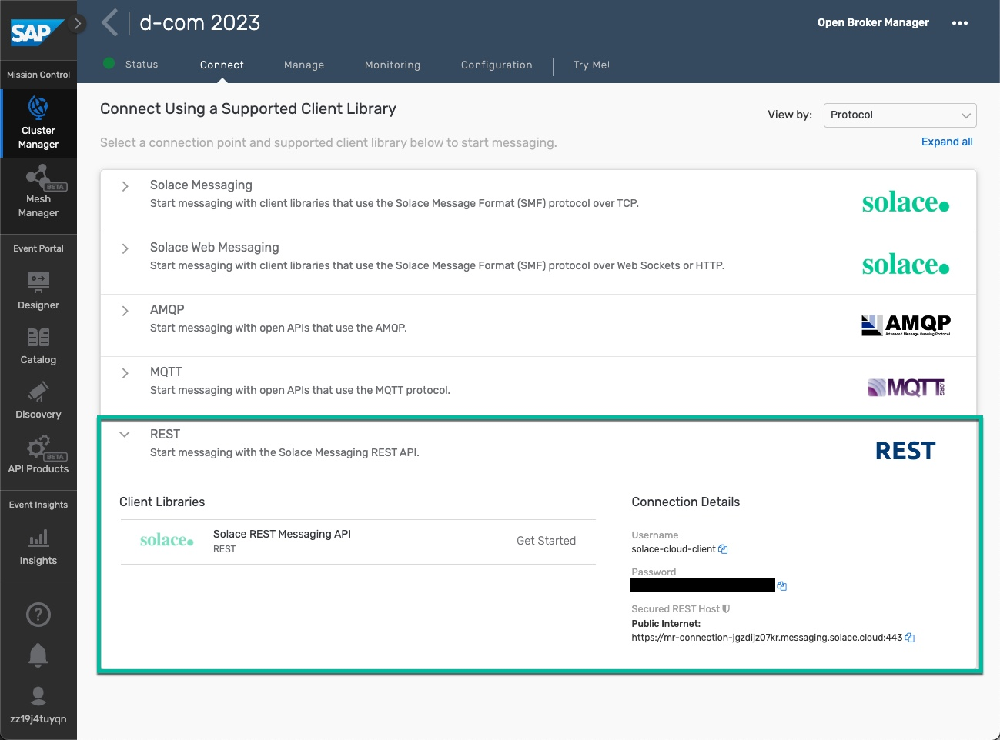
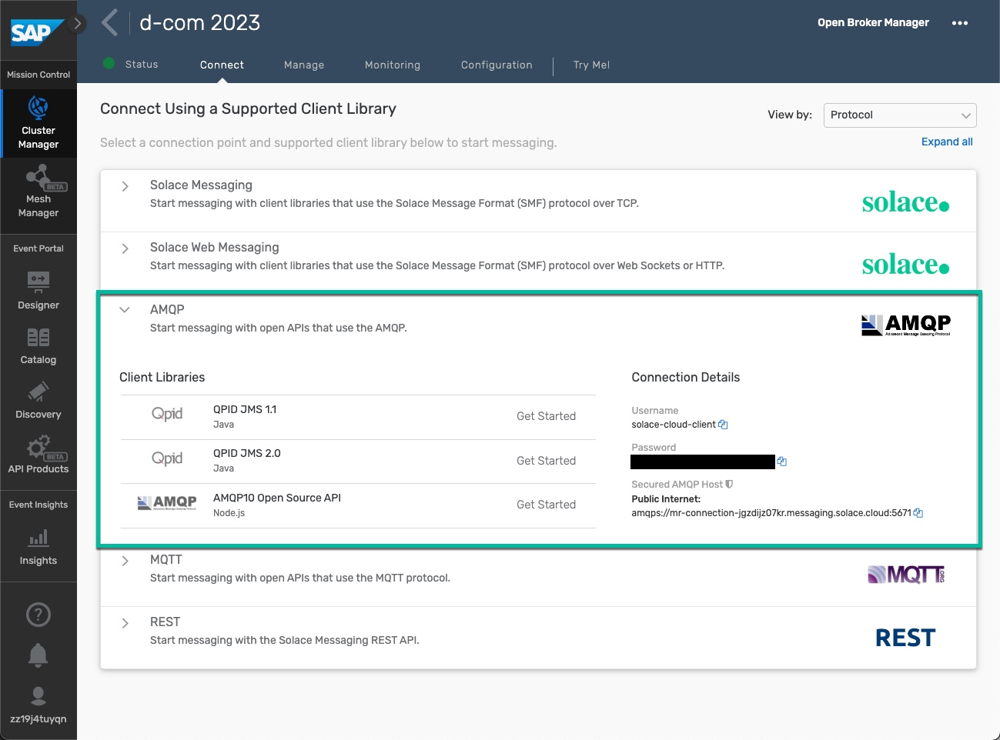
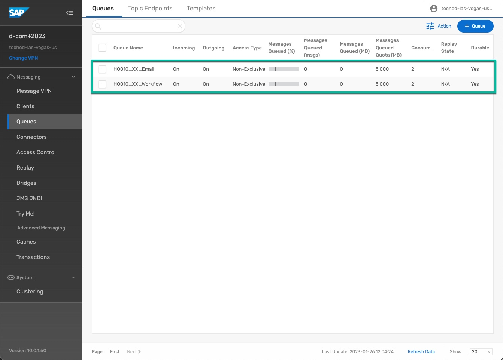
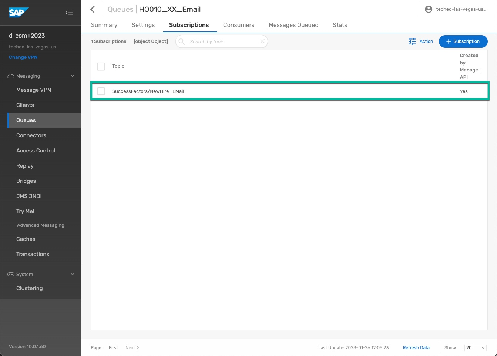

# SAP Integration Suite, advanced event mesh

## Service Description

Take advantage of a complete event streaming, event management, and monitoring platform that incorporates best practices, expertise, and technology for event-driven architecture (EDA) on a single platform. The following features are available for advanced event mesh:

- **Event Streaming:** Deploy event broker services, create event meshes, and optimize and monitor your event-driven system.
- **Event Management:** Design, discover, visualize, share, and manage various aspects of your event-driven architecture (EDA). You can also model your EDA to visualize component relationships.
- **Event Monitoring and Insights:** Use monitoring dashboards and confiJurabOe notLficatLons to detect potential issues before they negatively impact your brokers and event broker services.

Find out more about **SAP Integration Suite, advanced event mesh** in the [SAP Discovery Center](https://discovery-center.cloud.sap/serviceCatalog/advanced-event-mesh).

---

## Configuration Overview

The following configuration has been done in preparation for this hands-on session. This section is for review only. In this section, you get a view of the pre-configurations done so that an integration designed and deployed in SAP Integration Suite is triggered when there is a change in event (New Hire) in Employee Central.

1. REST endpoint: this is the endpoint used by SAP SuccessFactors to send events to AEM. The shown endpoint is providing the hostname. The actual topic the event is sent to, will be part of the URL configuration in SFSF. You can get more information about the SFSF configuration [here](../intro2).  	

2. AMQP endpoint: this is the endpoint used by the Integration Flows to connect to AEM. 

3. Queues: for each participant there are 2 queues preconfigured. **HO010_XX_Email** and **HO010_XX_Workflow** with **XX** the participant number assigned to you. You will deploy 2 Integration Flows, each subscribing to one of the queues.    

4. Topic Subscription: each of the queues is subscribed to the topics exposed by SAP SuccessFactors (e.g. `SuccessFactors/NewHire_EMail`). For each New Hire in SFSF an event is raised once and send to AEM. Each subscriber (=queue) gets its own copy of the event and can process it indepedently.  

---

## General information

If you want some more information on the general concepts around **Event-Driven Architectures**, you can check [here](https://solace.com/what-is-event-driven-architecture/) for a brief introduction.
